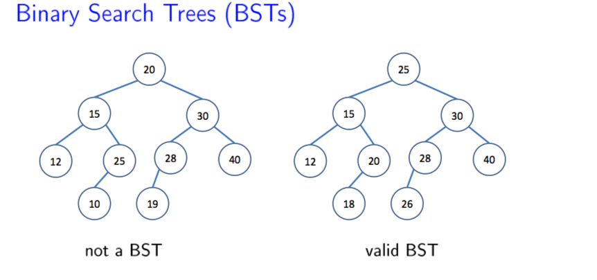

# Binary Search Tree(BST)

## Overview

 A Binary Search Tree aims to solve the following problems:
<ul>
  <li>a) Search(x) </li>
  <li>b) Insert(x) </li>
  <li>c) Remove(x) </li>
</ul>

 <b>Note:</b> x is an element in the data 

 Binary search tree aims to allow for all operations mentioned earlier (similar to array, or linked list), whilst minimizing time complexity for each to O(log n) on average, as long as tree is relatively balanced.

## Implementation

 Binary search tree maintains the following structure within data:
<ul>
  <li>For each node, value of all nodes in left subtree is less or equal</li>
  <li>For each node, value of all nodes in right subtree is greater</li>
</ul>

The following depicts valid BST vs not valid BST: 

.

### Searching for value in BST

 Searching BST for a value follows algorithm similar to binary search. We essentially compare value to root, if it's less than we search left subtree, if it's greater than, we search right subtree until we find equality or traverse entire tree. 

 <b>Time Complexity:</b> O(log n) for balanced BST, O(n) worse case

### Unbalanced BST

 Unbalanced BST is when sorted values are inserted into BST, and we end up with one long right subtree, or left subtree which is similar to a linked list 

